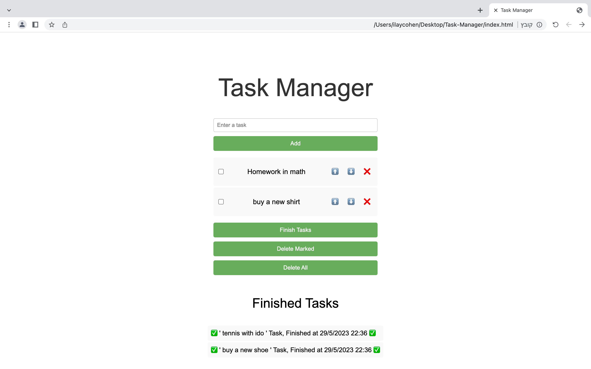

# Task Manager

Task Manager is a web-based application that helps you manage your tasks effectively. It allows you to add tasks, mark them as finished, mark them as important, and rearrange their order.



## Features

- Add Task: Easily add new tasks to the task list.
- Remove All Tasks: Easily clear all the tasks.
- Finish Task: Mark tasks as finished to keep track of completed tasks.
- Delete marked Tasks: Easily delete all tasks that marked.
- Rearrange Tasks: Move tasks up or down the list to prioritize or reorganize them.
- Responsive Design: The interface is optimized for various screen sizes and devices.

## Technologies Used

- HTML
- CSS
- JavaScript

## Usage

1. Clone the repository:

   ```shell
   git clone https://github.com/ilaycohen2712/task-manager.git
   
 ## Contributing

Contributions are welcome! If you have any suggestions, improvements, or bug fixes, please open an issue or submit a pull request.
